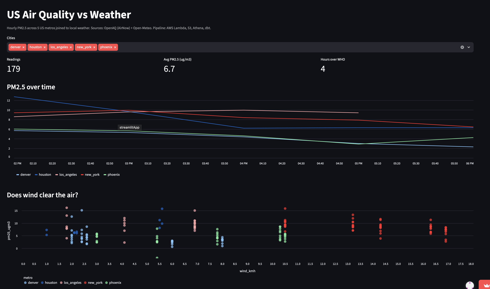
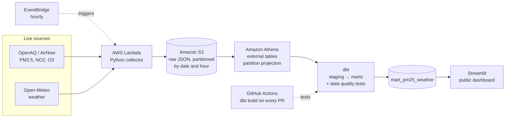

# US Air Quality vs Weather Pipeline

[](https://www.python.org/)
[](https://aws.amazon.com/lambda/)
[](https://aws.amazon.com/s3/)
[](https://aws.amazon.com/athena/)
[](https://www.terraform.io/)
[](https://www.getdbt.com/)
[](https://github.com/features/actions)
[](https://streamlit.io/)


A fully cloud-hosted, automated ELT pipeline that collects hourly air quality
and weather data for five US metros, transforms it with dbt on AWS Athena, and
serves it through a public dashboard. It runs on its own every hour, with no
machine of mine involved, and every change to the transformation logic is
tested automatically before it ships.

**Live dashboard:** https://air-quality-pipeline-7cfdgxr7dgdowhrdts4myk.streamlit.app



*Interactive Streamlit dashboard reading live from Amazon Athena.*

---

## Why this project

Air quality is shaped by weather, but pollution and weather data live in
separate systems that were never designed to be used together. This pipeline
brings them into one place, joining hourly PM2.5 to local wind, temperature, and
humidity for the same city and hour, so the relationship between them can
actually be measured.

The substance is in the engineering. Working with two live public sources means
reconciling different schemas and units, handling sensors that drop offline
mid-collection, removing duplicate records created by overlapping collection
windows, and aligning timestamps across sources before any join can be trusted.
The whole pipeline runs unattended in the cloud on an hourly schedule and tests
itself on every change, which is the standard a production pipeline is held to.

---

## Architecture



Everything runs in the cloud. The collector never touches a local machine.
Infrastructure (S3, Lambda, EventBridge, IAM) is defined in Terraform, so the
whole setup is reproducible from code. A layered dbt project turns raw JSON into
insight through `sources → staging → marts`.

---

## Tech stack

| Layer                 | Technology                                  |
|-----------------------|---------------------------------------------|
| Languages             | Python, SQL                                 |
| Infrastructure as code| Terraform                                   |
| Ingestion             | AWS Lambda (Python, requests)               |
| Scheduling            | Amazon EventBridge (hourly)                 |
| Data lake             | Amazon S3 (partitioned by date and hour)    |
| Query engine          | Amazon Athena (partition projection)        |
| Transformation        | dbt (dbt-athena) with data quality tests    |
| CI/CD                 | GitHub Actions (dbt build on every PR)      |
| BI / Dashboard        | Streamlit Community Cloud                    |
| Cloud / Auth          | AWS IAM, least-privilege scoped users       |

---

## How it works

Neither API hands you a clean, joined table. The work is collecting both
reliably, landing them so they stay cheap to query, and reconciling them into
one trustworthy model.

### 1. Extract and Load (Lambda + EventBridge)
A Python collector runs as an AWS Lambda, triggered every hour by EventBridge.
Each run it discovers live monitoring stations by coordinates and radius (so the
station list never goes stale), pulls the last several hours of readings per
sensor, and separately pulls hourly weather for each metro from Open-Meteo. It
writes both as newline-delimited JSON to S3, partitioned into
`raw/dt=YYYY-MM-DD/hour=HH/` folders. The collector throttles itself to stay
under the API rate limit and retries with backoff on network failures, so an
unattended 3am run survives a dropped connection instead of silently leaving a
gap.

### 2. Transform (dbt on Athena), the core
Athena reads the raw JSON directly through external tables that use partition
projection, so new hours are queryable the instant they land and queries scan
kilobytes instead of the whole lake. The dbt project is layered:

- Staging (stg_): one model per source. Casts timestamps, filters low-quality
  and null readings, and deduplicates. Because the collector pulls an
  overlapping window each run, the same sensor-hour lands multiple times; a
  window function collapses each sensor-hour to a single best row. A uniqueness
  test enforces that the dedup actually holds.
- Marts: `mart_pm25_weather` joins each PM2.5 reading to that city's weather for
  the same hour, and flags any hour over the WHO PM2.5 guideline. This is the
  table the dashboard reads, materialized as Parquet for speed.

### 3. Serve (Streamlit)
A Streamlit app queries the mart from Athena and renders KPIs, a PM2.5 over time
line chart, and a wind versus PM2.5 scatter (the "does wind clear the air"
question, visualized). It reads through a dedicated read-only AWS user, so the
public app can never modify anything.

### 4. Test on every change (GitHub Actions)
Every pull request that touches the dbt project triggers GitHub Actions, which
runs `dbt build` (all models plus all tests) against Athena in a separate CI
schema, so pull-request runs never touch the production tables. If a model
breaks or a test fails, the pull request goes red before it can merge.

---

## Data models

| Model              | Layer   | Purpose                                             |
|--------------------|---------|-----------------------------------------------------|
| stg_measurements   | staging | Clean, typed, deduplicated hourly pollutant readings|
| stg_weather        | staging | Clean, deduplicated hourly weather per metro        |
| mart_pm25_weather  | mart    | PM2.5 joined to weather per city-hour, WHO flag     |

Data quality is enforced with dbt tests (not_null, accepted_values, and a
unique-combination test on sensor and hour) across the models.

---

## Environments

The project separates production and CI, matching real team practice:

- Local and production dbt builds run into the `airquality` schema.
- CI builds into a separate `airquality_ci` schema on every pull request, so
  automated test runs never touch production tables while still reading the same
  raw source data.
- Access is split across least-privilege IAM users: one for Terraform, one
  scoped for CI, and a read-only one for the public dashboard.

---

## Key findings

*Figures are regenerated from the current data; see the live dashboard for the
latest. The pipeline is newly live and still accumulating history, so patterns
strengthen over time.*

- The highest PM2.5 spikes cluster at low wind speeds, and high-wind hours sit
  at moderate pollution levels, consistent with wind dispersing particulates.
- Pollution levels vary clearly by metro and by hour, with different cities
  peaking at different times of day.
- Hours over the WHO PM2.5 guideline are surfaced directly, so the dashboard
  doubles as a simple exceedance tracker.

---

## Data quality and honest limitations

- PM2.5 (micrograms per cubic meter) and the gases NO2 and O3 (parts per
  million) are reported in different units; they are kept in their native units
  rather than force-converted, and the flagship analysis focuses on PM2.5, which
  is the standard health metric.
- The WHO exceedance flag compares hourly readings against the 24-hour
  guideline, so it is an approximation used as a directional signal, not an
  official daily determination.
- Weather is taken at each metro's center point and joined to all of that
  metro's sensors, rather than interpolated to each sensor's exact location.
- Results reflect the data collected so far; the pipeline is live and growing.

Being explicit about limitations is intentional. Trustworthy analysis means
being clear about what the numbers can and cannot say.

---

## Repository structure

```
air-quality-pipeline/
├── collector/            # Python collector (runs as a Lambda)
│   ├── config.py         # metros, radius, pollutants
│   ├── net.py            # retry-enabled HTTP session
│   ├── discover.py       # runtime live-station discovery
│   ├── measure.py        # hourly pollutant readings
│   ├── weather.py        # Open-Meteo weather
│   ├── collect.py        # orchestrates a full collection
│   ├── lambda_function.py# Lambda entry point, writes to S3
│   └── build.sh          # builds the Lambda deployment zip
├── infra/                # Terraform (S3, Lambda, EventBridge, IAM)
├── transform/            # dbt project
│   └── models/
│       ├── staging/      # stg_ models + sources + tests
│       └── marts/        # mart_pm25_weather
├── dashboard/            # Streamlit app
├── .github/workflows/    # CI (dbt build on every PR)
└── README.md
```

---

## Running it

```bash
# Collector (extract + load), also runs unattended as a Lambda:
cd collector
uv run python collect.py

# Transformations (build models and run tests):
cd transform
uv run dbt build

# Dashboard (reads from Athena):
uv run streamlit run dashboard/app.py
```

Requires an OpenAQ API key (`OPENAQ_KEY`) and AWS credentials. Infrastructure is
provisioned with `terraform apply` from the `infra/` directory.

---

## Roadmap

- [ ] Add NO2 and O3 to the dashboard alongside PM2.5
- [ ] Additional marts: WHO exceedance hours per city, city reliability rankings
- [ ] Incremental dbt models as the history grows, to keep scans small
- [ ] Store the API key in AWS Secrets Manager and wire it into Lambda via Terraform
- [ ] Backfill historical data to strengthen day-of-week and seasonal patterns
- [ ] Data freshness monitoring and alerting on failed collection runs

---

## License

MIT
